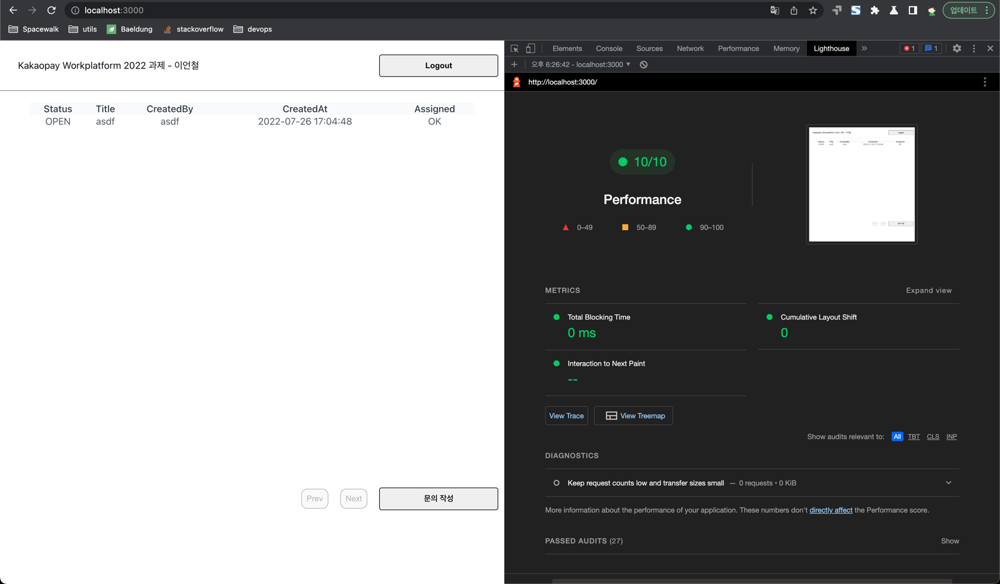
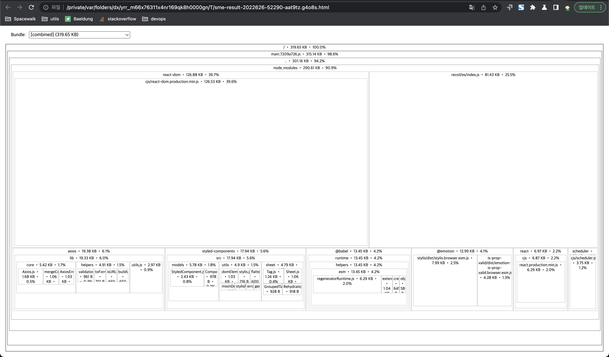

# 과제 kakaopay-frontend 2022
### yieon(parrotbill@naver.com)

---

### 개발 환경
stack| version |
|---|---|
|yarn | 1.22.17 |
|react | 18.2.0 |
|typescript | 4.7.4 |
|recoil | 0.7.4|

add library | version | description |
|---|---|---|
|create-react-app | 5.0.1 | project 생성 목적
|react-cookies | 0.1.1 | token 사용 목적
|styled-components | 5.3.5 | 명시된 컴포넌트 사용 목적
|react-router-dom | 6.3.0 | 페이지 라우팅 목적
|axios | 0.27.2 | API 통신 목적
|http-proxy-middleware | 2.0.6 | CORS 처리 목적
|source-map-explorer | 2.5.2 | Bundle Size 체크 목적

### get started
```
yarn
yarn start
```

### page routes 
path| description |
|---|---|
| / | 메인(로그인 및 문의 목록 조회) 페이지 |
| /inq/write | 문의 작성 페이지 |
| /inq/:id | 문의 상세 정보 페이지 |

### browser performance check


### bundle size check
```
yarn analyze
```


### 문제 해결 전략
- CORS 설정을 위한 proxy 미들웨어를 설정하였습니다.
  - 하지만 이 코드는 .js 로만 동작하여 다소 클린하지 못한 코드가 될 수 있습니다.
  - 실제 운영 시 이 코드는 의미없는 코드가 될 것입니다. (CORS 문제가 발생 할 수 없는 환경)
- lint의 부재
  - 협업 프로젝트가 아니기에 lint는 진행하지 않았습니다.
  - 협업 외에 lint가 필요한 상황일 때에는 lint를 설정하는 것을 권장합니다.
- micro frontend
  - 이 프로젝트는 micro frontend가 고려되지 않았습니다. micro를 고려한다면 SSR의 root project를 생성하는 것이 효과적일 수 있습니다.
- recoil
  - recoil은 아직 해결되지 않은 성능 이슈가 존재합니다.
  - 이 프로젝트에서는 전역 상태관리 atom을 사용하기 위한 선택을 하였습니다. 좀 더 나은 대안이 존재 할 수 있습니다.
- document
  - front 항목을 위한 도큐먼트의 방식을 선정해 볼 필요가 있을 것 같습니다.
    - readthedocs을 통한 github repo와 연동된 master document를 고려해 볼 수 있을 것 같습니다.
  
